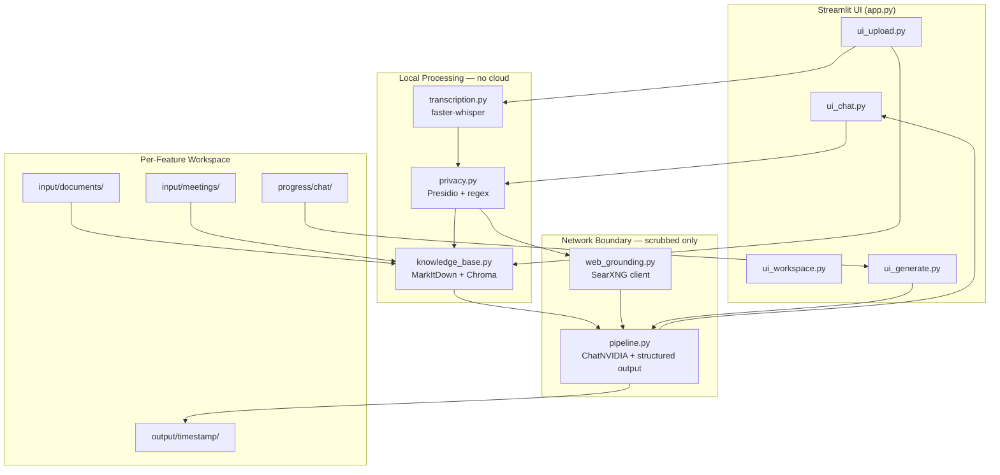

# Shadow PO — Technical Report

**System:** Shadow PO — AI-Powered Cognitive Mentor for Product Requirement Refinement  
**Framework:** LangChain + NVIDIA NIM + Chroma RAG  
**Author:** Cristhian Zenteno  
**Date:** June 2026  
**Repository:** `shadow-product-owner`

---

## 1. Problem Definition

### 1.1 Target User

The primary user is a **Software Engineer** (Backend, Frontend, Fullstack, or QA) working during **Sprint Refinements** or **Product Discovery**. They receive high-level business requirements from a Product Owner (PO) that often omit implicit technical constraints — concurrency rules, error handling, data boundaries, and edge cases.

### 1.2 Current Workflow and Inefficiencies

| Step | What happens today | Pain point |
|---|---|---|
| PO presents feature | Business language, user stories, slide decks | No explicit technical implications |
| Engineer asks clarifying questions | Ad-hoc, often incomplete | Context lost between meetings |
| Implementation starts | Edge cases surface mid-sprint | Rework, technical debt, sprint delays |

Three recurring bottlenecks:

1. **Conceptual translation gap** — the PO's intent and the engineer's execution model diverge silently.
2. **Context fragmentation** — requirements live in PDFs, meeting recordings, and chat threads with no unified retrieval layer.
3. **Sensitive data exposure** — refinement meetings contain API keys, internal codenames, and PHI that must not reach cloud LLMs unfiltered.

### 1.3 Business Impact

Fixing requirement misunderstandings during implementation costs significantly more than catching them during design. Shadow PO targets the **pre-coding phase**: it helps engineers build a shared, structured understanding before a single line of feature code is written.

---

## 2. Use Case

**Shadow PO** acts as a cognitive sparring partner that:

1. Answers questions grounded in the feature's own documents and meeting transcripts (RAG).
2. Optionally searches the public web for industry standards when the question requires it.
3. Generates Gherkin scenarios and Mermaid diagrams on explicit request.
4. Tracks PO answers during chat so future doc generation reflects resolved questions.
5. Packages accumulated understanding into four structured Markdown artifacts on demand.

**Demo workspace:** `workspaces/eligibility/` — a Physical Therapy EMR insurance eligibility verification feature with four PRD documents, a meeting transcript, and live chat history demonstrating end-to-end usage.

---

## 3. System Architecture

Shadow PO is implemented as a **modular Python pipeline** with a Streamlit UI. The core LLM orchestration lives in `shadow_po/pipeline.py`; each concern is isolated in its own module under `shadow_po/`.



### 3.1 Module Map (17 source files)

| Module | Role |
|---|---|
| `app.py` | Streamlit entry point — three tabs: Chat, Upload, Generate Docs |
| `pipeline.py` | LLM orchestration: scrub → RAG → optional web search → structured LLM call |
| `knowledge_base.py` | Document ingestion, chunking, local embeddings, Chroma retrieval |
| `privacy.py` | Presidio PII detection + custom codename regex — hard gate before any network call |
| `web_grounding.py` | SearXNG HTTP client with explicit unavailability signalling |
| `transcription.py` | Local audio/video → text via faster-whisper (ffmpeg for video) |
| `schemas.py` | Pydantic contracts: `ShadowPOAnswer` (chat) and `GeneratedDocs` (doc generation) |
| `generate_docs.py` | Gathers all sources, calls LLM, writes four timestamped Markdown files |
| `answered_questions.py` | Detects PO answers in chat, appends to `answered-questions.md`, re-indexes |
| `chat_history.py` | Append-only conversation persistence under `progress/chat/` |
| `workspace.py` | Creates per-feature folder structure |
| `mermaid_format.py` | Normalizes LLM Mermaid output for valid rendering |
| `ui_*.py` | Streamlit panels wired to the modules above |

### 3.2 Per-Feature Workspace Isolation

Each feature gets an isolated folder. Chroma collections are scoped per workspace — a query in `eligibility` cannot retrieve chunks from `one-click-checkout`. This is enforced in code via `_collection_name()` in `knowledge_base.py` and verified by cross-workspace isolation tests in `tests/test_knowledge_base.py`.

---

## 4. Implementation — LLM Pipeline

The assignment requires at least one LLM pipeline with retrieval, structured prompts, and context handling. Shadow PO implements this in `pipeline.answer_question()` and `generate_docs.generate_docs()`.

### 4.1 Chat Pipeline (`pipeline.answer_question`)

The five-step flow implemented in code:

```python
# shadow_po/pipeline.py — simplified flow

scrubbed_question = privacy.scrub(question)                          # Step 1
chunks = kb.retrieve(workspace_path, scrubbed_question, k=5)         # Step 2

if _needs_grounding(scrubbed_question):                              # Step 3
    search_result = web_grounding.search_web(scrubbed_question, ...)

prompt = _build_prompt(question, chunks, web_snippets, ...)          # Step 4
raw_answer = get_llm(model_name).with_structured_output(             # Step 5
    ShadowPOAnswer
).invoke(prompt)
```

**LangChain integration:** `get_llm()` returns a `ChatNVIDIA` instance from `langchain-nvidia-ai-endpoints`. Structured output is enforced via `llm.with_structured_output(ShadowPOAnswer)`, binding the model response to a Pydantic schema before it reaches the UI.

**Model:** `nvidia/nemotron-3-ultra-550b-a55b` (configured in `settings.yaml`) — free-tier NVIDIA NIM endpoint with 1M-token context and native LangChain support.

### 4.2 RAG Pipeline (`knowledge_base.py`)

| Stage | Implementation | Runs locally? |
|---|---|---|
| Document conversion | MarkItDown (PDF, DOCX, PPTX, images) | Yes |
| Chunking | Paragraph-aware split, 1000 chars, 200 overlap | Yes |
| Privacy scrub | Presidio before embedding | Yes |
| Embedding | `sentence-transformers/all-MiniLM-L6-v2` | Yes |
| Vector store | Chroma persistent client per workspace (`.chroma/`) | Yes |
| Retrieval | Top-k cosine similarity query, default k=5 | Yes |

Indexing is **explicit** — the user clicks "Save & Index" in the Upload tab. Chunks from a re-uploaded file replace stale entries via hash-based IDs, and `reindex_file()` supports incremental updates when `answered-questions.md` changes.

### 4.3 Web Grounding (`web_grounding.py` + `pipeline._needs_grounding`)

Web search is **conditional**, not automatic. Regex heuristics in `pipeline.py` detect questions that need public information (e.g. "industry standard", "GDPR", "best practices"). Local workspace questions skip SearXNG entirely, saving latency and cost.

When SearXNG is unreachable, the code returns a `GroundingUnavailable` sentinel — not an empty list. The pipeline injects a `grounding_note` into the prompt so the model tells the user grounding failed rather than hallucinating web-sourced confidence.

### 4.4 Structured Output Schemas (`schemas.py`)

Two Pydantic models enforce output shape at the LangChain boundary:

**`ShadowPOAnswer`** — chat responses:
- `answer` (required plain-language text)
- `gherkin` / `diagram` (optional, stripped post-call unless explicitly requested)
- `grounded` / `grounding_note` (web search metadata)

**`GeneratedDocs`** — doc generation package:
- `business_rules`, `scenarios`, `diagram`, `open_questions` → written as four separate `.md` files

Post-processing in `pipeline.py` clears `gherkin` and `diagram` when the user did not ask for them, preventing scope creep. `mermaid_format.py` normalizes diagram syntax (declaration headers, multi-line Notes, fenced code stripping).

### 4.5 Privacy Scrubber (`privacy.py`)

Every text path — questions, documents, search queries, transcripts — passes through `privacy.scrub()` before any network call or embedding.

Presidio detects: emails, IPs, credit cards, phone numbers, person names, API keys (custom regex patterns). Custom project codenames from `settings.yaml` are redacted via case-insensitive regex.

**Failure mode:** if the scrubber is not initialized, `answer_question()` and `retrieve()` raise `RuntimeError` immediately. There is no bypass path.

### 4.6 Local Transcription (`transcription.py`)

Audio and video files are transcribed entirely on-device using `faster-whisper`. Video files are demuxed via `ffmpeg` to a temporary WAV before transcription. Raw audio never leaves the machine. The resulting transcript is scrubbed before indexing or LLM use.

Configurable via `settings.yaml`:

```yaml
whisper:
  model_size: "base"    # tiny | base | small | medium | large-v3
  device: "cpu"         # cpu | cuda
  compute_type: "int8"
```

### 4.7 Generate Docs Pipeline (`generate_docs.py`)

Triggered from the Generate Docs tab. Steps:

1. `gather_feature_context()` — loads all documents, transcripts, chat history, and answered questions.
2. Builds a prompt from `prompts/generate_docs_system_prompt.md` + assembled context.
3. Calls `get_llm().with_structured_output(GeneratedDocs).invoke(...)`.
4. Filters `open-questions.md` against already-recorded answers.
5. Writes four files to `output/<YYYY-MM-DD_HHMM>/` — never overwrites previous runs.

If any source file is unreadable or the LLM call fails, the function raises loudly with no partial output written.

### 4.8 Answered Questions Loop (`answered_questions.py`)

After each assistant turn, `detect_answered_question()` sends the conversation history to the LLM asking whether the user's message resolved a previously raised open question. If detected:

1. Appends the Q&A pair to `input/documents/answered-questions.md`.
2. Calls `knowledge_base.reindex_file()` so the answer is immediately retrievable in future chat turns.

This creates a feedback loop: chat → answered questions → RAG index → better future answers.

---

## 5. Iteration and Improvements

Improvements were driven by test failures and real usage in the `eligibility` workspace, not by spec documents.

### 5.1 Mermaid Rendering Failures

**Problem:** The LLM returned Mermaid diagrams without type declarations, with multi-line `Note` blocks, or embedded inside the `answer` field — all of which broke Streamlit's `st.mermaid()` renderer.

**Fix (code):** Added `shadow_po/mermaid_format.py` with:
- `normalize_mermaid_source()` — injects missing `sequenceDiagram` / `flowchart TD` headers
- `split_answer_and_diagram()` — extracts diagrams accidentally placed in the answer field
- `_merge_multiline_notes()` — collapses invalid multi-line Note syntax

Post-processing runs in `pipeline.answer_question()` after the structured LLM call. Covered by `tests/test_mermaid_format.py`.

### 5.2 Gherkin/Diagram Scope Creep

**Problem:** The model generated Gherkin scenarios and diagrams for ordinary questions, cluttering chat responses.

**Fix (code):** Regex detectors `_requests_gherkin()` and `_requests_diagram()` in `pipeline.py`. After the LLM call, fields are forcibly set to `None` unless the user's question matched the patterns. Prompt sections for diagram/Gherkin requirements are only injected when needed.

### 5.3 Web Grounding Without Indexed Documents

**Problem:** Early chat sessions on the `eligibility` workspace returned generic answers (e.g. YouTube Feature Eligibility) because documents were uploaded but not indexed, and web grounding triggered on broad questions.

**Fix (code + usage):** Explicit indexing step in the Upload UI. `_needs_grounding()` uses word-boundary regex to avoid false positives. When no chunks exist, the prompt includes `_No indexed documents found for this workspace. Answer from general knowledge._` so the model's behavior is transparent.

After indexing four PRD documents, the third identical question correctly returned PT insurance eligibility with EDI 270/271 details, Gherkin scenarios, and a state diagram — visible in `workspaces/eligibility/progress/chat/998214b5.md`.

### 5.4 SearXNG JSON 403

**Problem:** Default SearXNG Docker image disables JSON output, returning HTTP 403.

**Fix (code + infra):** Bundled `docker/searxng/settings.yml` mounted via `docker-compose.searxng.yml`. `web_grounding.py` treats non-200 responses as `GroundingUnavailable`.

---

## 6. Trade-off Analysis

### 6.1 Latency vs. Accuracy

| Choice | Latency impact | Accuracy benefit |
|---|---|---|
| Conditional web grounding (regex gate) | Skips ~2–10s SearXNG call for most questions | Local-doc questions answered faster without noise |
| Local embeddings (MiniLM-L6-v2) | ~100ms retrieval vs. cloud embedding APIs | Zero network dependency; no API cost |
| Structured output (`with_structured_output`) | One LLM call with schema enforcement | Eliminates JSON parsing failures and invalid field shapes |
| Whisper `base` model | ~real-time on CPU for short clips | Good enough for refinement meetings; upgradeable to `large-v3` |

**Decision:** Prioritize deterministic, grounded answers over speed. A 3–5 second chat response with verified context is preferable to a sub-second hallucination during refinement.

### 6.2 Cost vs. Quality

| Component | Cost |
|---|---|
| NVIDIA NIM (nemotron-3-ultra) | Free tier — no credit card |
| Embeddings (sentence-transformers) | $0 — runs locally |
| Whisper (faster-whisper) | $0 — runs locally |
| Chroma vector store | $0 — local disk |
| SearXNG | $0 — self-hosted Docker |
| Presidio | $0 — local inference |

Total infrastructure cost for the prototype: **$0.00**. The trade-off is operational: the developer must run SearXNG locally and manage the NVIDIA API key.

### 6.3 Simplicity vs. Retrieval Quality

The chunking strategy is paragraph-based (1000 chars, 200 overlap) without MMR or reranking. This keeps the implementation understandable and testable but may miss context that spans distant document sections.

**Production upgrade path:** add a cross-encoder reranker (e.g. `ms-marco-MiniLM-L-6-v2`) on retrieved chunks before prompt assembly — a localized change in `knowledge_base.retrieve()`.

### 6.4 Known Limitations

1. **No conversation memory in the LLM call** — each question is stateless; prior turns are not injected into the prompt (history is saved to disk but not fed back automatically).
2. **Heuristic grounding gate** — `_needs_grounding()` may miss questions needing web context or trigger unnecessarily.
3. **Answered-question detection** — relies on a second LLM call with non-deterministic results.
4. **Single LLM provider** — NVIDIA NIM only; no fallback model configured.

---

## 7. Production Considerations

### 7.1 Monitoring and Observability

The codebase uses Python `logging` throughout (`pipeline.py`, `knowledge_base.py`, `web_grounding.py`, etc.). For production, these logs integrate with:

- **LangSmith** — wrap `answer_question()` and `generate_docs()` with LangChain tracing callbacks to capture prompt size, latency, token usage, and structured output validation failures.
- **Structured JSON logging** — replace plain log lines with JSON events (timestamp, component, workspace, chunk_count, grounded, latency_ms) for ingestion into Datadog or CloudWatch.

### 7.2 Error Handling and Fallbacks

| Failure | Current behavior | Production recommendation |
|---|---|---|
| Scrubber not initialized | Hard stop (`RuntimeError`) | Health check on startup |
| NVIDIA API key missing | Clear UI error in `ui_chat.py` | Secret manager + retry queue |
| SearXNG unavailable | `grounding_note` injected into answer | Circuit breaker; skip search for N minutes |
| LLM structured output failure | Exception propagated to UI | Retry with simplified schema; alert on repeated failures |
| Generate docs partial failure | No files written; `RuntimeError` raised | Transactional write with temp directory + atomic rename |

### 7.3 Security

- **Prompt injection:** RAG chunks are treated as untrusted context. The system prompt instructs the model to ground answers in provided context but does not execute code from documents.
- **Data leakage:** The privacy scrubber is a hard gate — no network path bypasses it. Custom codenames must be configured in `settings.yaml` for org-specific terms Presidio cannot detect.
- **PHI / HIPAA:** The eligibility demo workspace contains healthcare scenarios. Presidio catches common PII patterns, but production healthcare deployment would require a HIPAA-compliant LLM endpoint and a BAA with the provider.
- **Workspace isolation:** Per-feature Chroma collections prevent cross-feature data leakage at the retrieval layer.

### 7.4 Scalability

The current architecture is single-user / single-machine. To scale:

1. Replace Chroma local disk with a managed vector DB (pgvector, Pinecone) keyed by workspace ID.
2. Move Streamlit to a multi-tenant web app with authenticated workspace access.
3. Queue transcription jobs (Celery + Redis) for long meeting recordings.
4. Cache embeddings — skip re-embedding unchanged files via content-hash comparison in `index_workspace_documents()`.

---

## 8. Evaluation of Results

This section evaluates Shadow PO against the original SDLC problem — helping engineers understand ambiguous requirements before implementation — from two angles: whether the **user workflow** delivers practical value, and whether the **architecture** holds up under real usage.

### 8.1 User Workflow Evaluation

Shadow PO was exercised end-to-end using the `eligibility` workspace: a PT clinic insurance verification feature with four PRD documents, a meeting transcript, and multiple chat sessions.

| User goal | Expected outcome | Observed result |
|---|---|---|
| Understand a feature from uploaded specs | Answers reflect the team's own documents, not generic definitions | After documents were indexed, questions about "the eligibility feature" returned PT-specific content: EDI 270/271 flows, visit limits, Green/Yellow/Red status rules |
| Explore requirements interactively | Conversational answers that a developer can act on during refinement | Chat produced plain-language explanations; on explicit request, Gherkin scenarios and a state diagram were returned in separate fields |
| Capture PO clarifications during refinement | Resolved questions persist and influence future output | Answered Q&A pairs append to `answered-questions.md` and re-enter the knowledge base for later retrieval |
| Package understanding for the team | Structured artifacts a teammate can read without replaying the chat | "Generate docs" produced four timestamped files: business rules, scenarios, diagram, and open questions |
| Work with sensitive material safely | No raw corporate or clinical data sent to cloud services unfiltered | Audio transcribed locally; all text scrubbed before embedding or LLM calls |

**User value delivered:** A developer working on the eligibility feature can move from "I have four PDFs and a meeting recording" to "I have domain-grounded answers, testable scenarios, and a shareable spec package" within a single workspace — without leaving the refinement context or manually stitching sources together.

**Remaining user friction:** Each chat turn is independent; the model does not automatically see prior turns in the same conversation. The developer must re-state context or rely on RAG retrieval to surface earlier material. Conversation history is persisted for human review and for "Generate docs," but not injected into every chat prompt — a deliberate simplicity trade-off that limits multi-turn reasoning.

### 8.2 Architectural Goal Assessment

The system was designed around four architectural principles. The table below evaluates whether the prototype achieves them in practice.

| Architectural principle | Design intent | Evaluation |
|---|---|---|
| **Privacy-first boundary** | Nothing crosses the network unscrubbed; audio stays local | Achieved. Presidio runs before every embedding and LLM call. Whisper runs entirely on-device. Scrubber failure stops the pipeline — no silent bypass |
| **Per-feature isolation** | One workspace per feature; no cross-contamination between tickets | Achieved. Each workspace owns its Chroma collection, folder tree, and chat history. Retrieval is scoped to the active workspace only |
| **Grounded, not hallucinated** | Answers cite workspace context; web search is optional and disclosed | Mostly achieved. With indexed documents, answers align with PRD content (EDI codes, status rules, personas). When workspace context is absent, the system falls back to general or web knowledge — behavior that is architecturally correct but requires the user to maintain an indexed knowledge base |
| **Structured, predictable output** | Chat and doc generation produce schema-valid artifacts, not free-form prose | Achieved. `ShadowPOAnswer` and `GeneratedDocs` Pydantic schemas enforce field boundaries via LangChain structured output. Gherkin and diagrams appear only when explicitly requested |
| **Two distinct flows** | Chat for exploration; "Generate docs" for packaging — not merged | Achieved. Chat is lightweight and conversational. Doc generation gathers all sources (documents, transcripts, chat, answered questions) in a separate, heavier pipeline |
| **Honest degradation** | When a component is unavailable, the user is told — not misled | Achieved. SearXNG failures surface a `grounding_note` in the answer. Missing API keys show a clear UI error. Doc generation fails completely rather than writing partial files |

**Overall architectural assessment:** The modular split (privacy → RAG → optional web → LLM → persistence) is coherent and testable. Each layer has a single responsibility and a defined failure mode. The answered-questions feedback loop (chat → file → re-index → retrieval) closes the refinement cycle architecturally, even though detection quality depends on LLM judgment.

### 8.3 Output Quality Assessment

Evaluated against the assignment criteria: accuracy, hallucination risk, and acceptable performance.

**Accuracy — when context is present**

Using the eligibility PRDs, the system correctly identified:

- Functional requirements FR-1 through FR-4 (batch verification, manual ad-hoc checks, EDI 271 parsing, status rules engine)
- PT-specific constraints (Service Type Code 30, visit caps, pre-authorization)
- User personas (front desk, biller, therapist) and their distinct information needs

Generated Gherkin scenarios reflected happy-path and failure-path behaviors described in the source documents, not invented business rules.

**Hallucination risk — controlled but not eliminated**

| Scenario | Risk level | Mitigation in architecture |
|---|---|---|
| Question answerable from indexed docs | Low | RAG retrieves top-k chunks; prompt instructs grounding in provided context |
| Question requiring industry standards | Medium | Conditional SearXNG search adds external snippets; `grounded` flag discloses web use |
| Question with no workspace context | Higher | Model falls back to general knowledge — architecturally transparent via empty-chunk prompt message, but user must recognize generic answers |
| Doc generation across many sources | Low–Medium | Full context assembly reduces single-source blind spots; answered-questions filter prevents re-raising resolved items |

The architecture reduces hallucination surface area but does not guarantee factual correctness — the developer remains the final reviewer, which matches the intended role of Shadow PO as a **cognitive mentor**, not an autonomous decision-maker.

**Performance — acceptable for refinement, not real-time**

| Operation | Typical experience | Fit for use case |
|---|---|---|
| Document indexing (first time) | Seconds to minutes depending on file count and embedding model load | Acceptable — run once per upload batch during setup |
| Chat response | Several seconds (RAG retrieval + LLM inference) | Acceptable — refinement is async, not pair-programming |
| Local transcription | Proportional to recording length; first run downloads Whisper model | Acceptable — meetings are processed offline, not during live chat |
| Generate docs | Longer than chat — full context + four-file structured output | Acceptable — deliberate, on-demand action, not per-message |

For Sprint Refinement sessions where engineers think in minutes, not milliseconds, latency is within acceptable bounds. The architecture would need caching and async job queues for team-wide concurrent usage.

### 8.4 Summary — Does the System Solve the Problem?

**From the user's perspective:** Shadow PO successfully bridges the gap between PO-level business language and engineer-ready artifacts. A developer refining the eligibility feature can query domain-specific requirements, request test scenarios and diagrams on demand, record PO answers, and export a structured spec package — all within one isolated workspace.

**From the architectural perspective:** The privacy boundary, per-feature RAG isolation, structured output contracts, and dual-flow design (chat vs. generate) work as intended. The main architectural gaps for production are stateless chat (no automatic multi-turn memory), heuristic web-grounding triggers, and single-machine deployment — none of which undermine the prototype's core value proposition, but all of which would need addressing before team-scale rollout.

**Verdict:** The prototype meets the assignment objective — a functional LLM-based pipeline that demonstrates architectural decision-making, component integration, and production-oriented thinking — while honestly exposing the boundaries where human judgment and indexed context remain essential.

---

## 9. Technical Decisions Summary

| Decision | Alternatives considered | Why this choice |
|---|---|---|
| LangChain `ChatNVIDIA` + `with_structured_output` | Raw REST API, LCEL chains | Native NVIDIA integration; Pydantic schema enforcement without manual JSON parsing |
| Chroma (local, per-workspace) | FAISS, pgvector, Pinecone | Zero setup, persistent disk, trivial per-collection isolation |
| sentence-transformers (local) | OpenAI embeddings, Cohere | No API key, no network, Apache 2.0 license |
| Presidio (local) | Regex-only scrubber | Language-aware PII detection beyond pattern matching |
| faster-whisper (local) | Cloud STT (Google, AWS) | Audio never leaves the machine; $0 cost |
| SearXNG (self-hosted) | Google Search API, Tavily | No API key, privacy-preserving, AGPL self-hosted |
| Conditional web grounding | Always search | Reduces latency and prevents irrelevant web noise |
| Explicit indexing | Auto-index on upload | User controls what enters the vector store |
| Function-based orchestration | Full LCEL chain | Readable, testable, easy to mock individual steps |

---

## 10. Repository Structure

```
shadow-product-owner/
├── app.py                          # Streamlit entry point
├── settings.yaml                   # Model, Whisper, embedding, SearXNG config
├── shadow_po/                      # 17 Python modules (core logic)
├── prompts/generate_docs_system_prompt.md
├── tests/                          # 13 test modules, 145 tests
├── workspaces/                     # Per-feature runtime data
│   └── eligibility/                # Demo workspace with PRDs + chat history
├── docker-compose.searxng.yml      # Web grounding service
└── pyproject.toml                  # uv-managed dependencies
```

**Key dependencies:** `langchain-nvidia-ai-endpoints`, `chromadb`, `sentence-transformers`, `faster-whisper`, `presidio-analyzer`, `markitdown`, `streamlit`.

---

## 11. Conclusion

Shadow PO demonstrates a production-oriented LLM pipeline for a real SDLC problem: translating ambiguous product requirements into engineer-ready understanding. The implementation prioritizes **privacy** (local scrubbing before every network call), **grounding** (per-feature RAG with optional web search), and **structured output** (Pydantic-enforced schemas via LangChain) over a minimal proof-of-concept.

The codebase is modular (17 independent modules), fully tested (145 unit tests with mocked LLM calls), and runnable at zero infrastructure cost using NVIDIA NIM's free tier and local open-source components for embeddings, transcription, and vector search.

---

*This report reflects the implemented codebase as of June 2026. Export to PDF for Moodle submission.*
